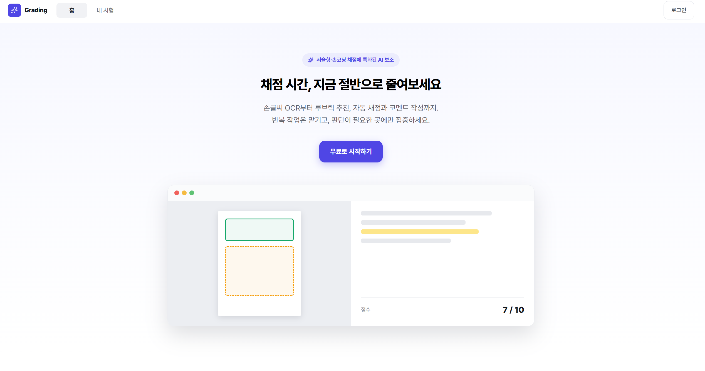
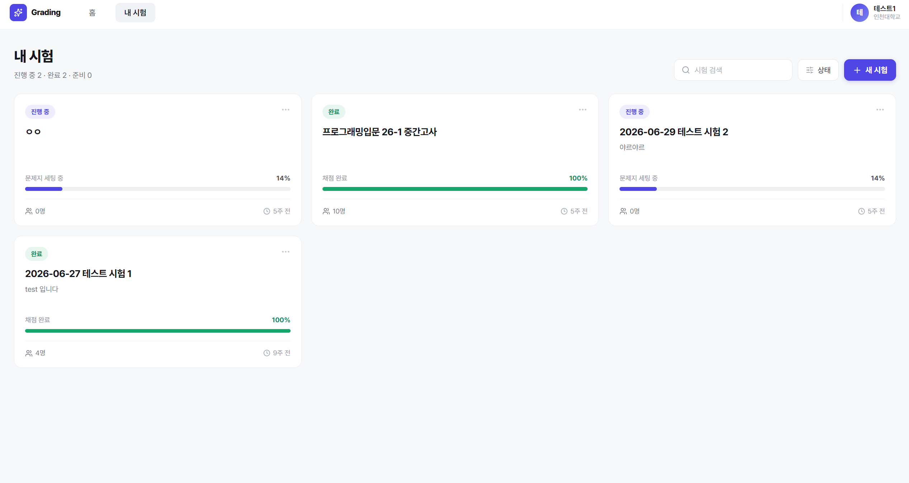
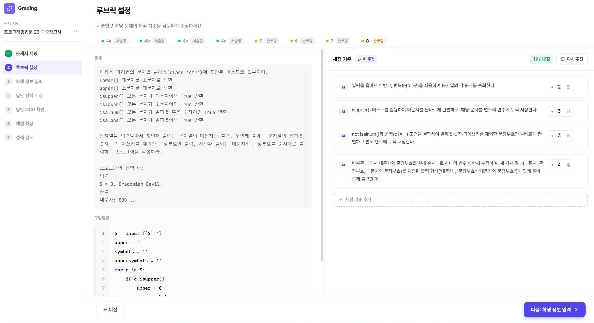

# Auto Grading Web

손글씨 시험 답안지를 **OCR로 인식**하고 **AI로 자동 채점**하는 웹 서비스입니다.
**객관식부터 서술형·코딩 문제까지** 다양한 유형을 지원하며, 답안 영역 지정부터 OCR, 루브릭 기반 채점, 결과 통계까지 반복 작업을 자동화해 채점 시간을 절반으로 줄여줍니다.



## 주요 기능

- **다양한 문제 유형 지원** — 객관식, 서술형, 코딩 문제를 모두 채점
- **손글씨 OCR** — 스캔한 답안지에서 문제/답안 영역을 지정하면 손글씨 텍스트를 자동 인식
- **AI 자동 채점** — 정답 및 루브릭 기준에 따라 객관식·서술형·코딩 문제를 자동 채점
- **AI 루브릭 추천** — 문제 내용을 기반으로 채점 기준을 제안하고 코멘트 자동 작성
- **결과 통계 & CSV 내보내기** — 학생별·문항별 점수 분석과 결과 다운로드

## 시험 관리 대시보드

진행 중/완료된 시험을 한눈에 보고, 새 시험을 생성해 채점 워크플로우를 시작합니다.



## AI 루브릭 기반 채점

문제와 모범 답안을 검토하며 AI가 제안한 채점 기준(루브릭)을 확인하고 수정할 수 있습니다.



## 기술 스택

React 19 · TypeScript · Vite · TanStack Query · Zustand · React Router · Konva · react-pdf · Tailwind CSS

## 실행 방법

```bash
npm install
npm run dev
```

`.env.local`에 `VITE_API_BASE_URL`을 설정하세요. (기본값: `/api/v1`)
